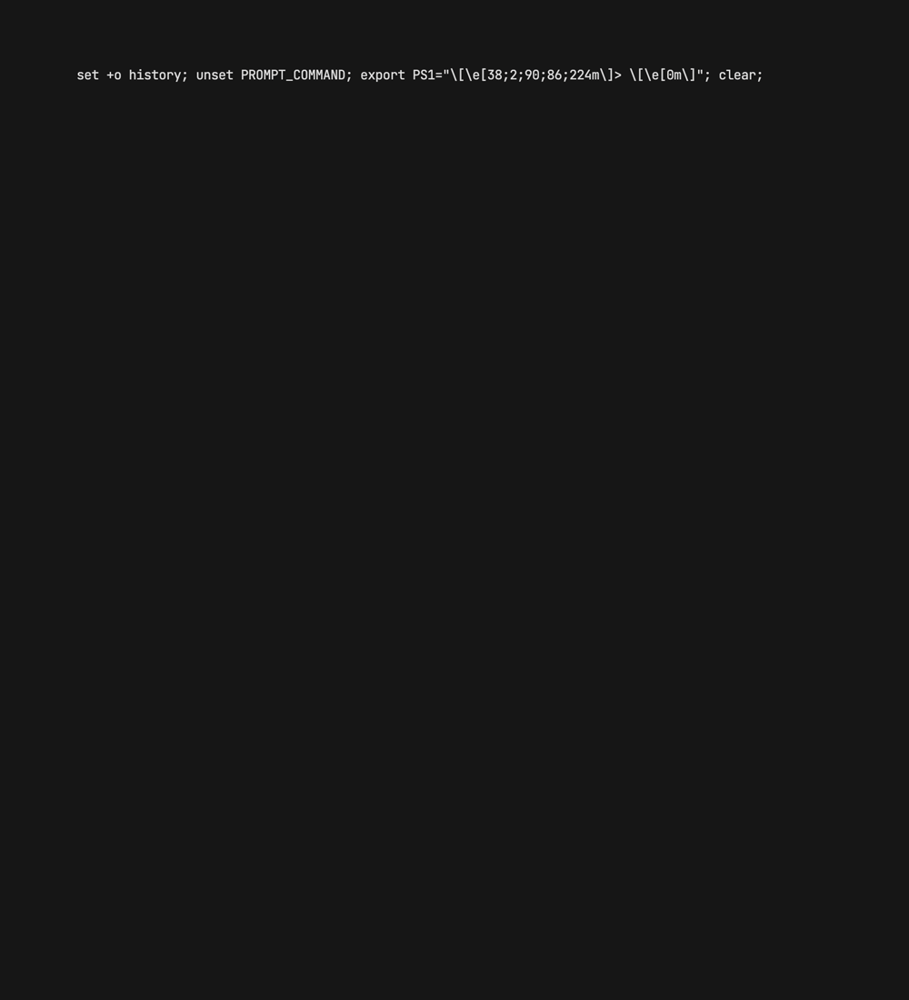

# NAU 
The side-project manager you didn't know you needed.
# Installation
```bash
# macOS or Linux
brew tap antonio-leitao/taps
brew install nau
```
## Getting Started 
NAU allows you to store permanent variables such as your name, email and website for automatically adding in projects.
It also requires you to supply a directory where to store your Projects, where your Templates are and where you want to store your Archives.
The default configuration fields are the following:
```text
AUTHOR=         Antonio Leitao
WEBSITE=        https://antonio-leitao.github.io
EMAIL=          aleitao@novaims.unl.pt
REMOTE=         https://github.com/antonio-leitao
BASE_COLOR=     #814584
EDITOR=         nvim
PROJECTS_PATH=  /Documents/Projects
TEMPLATES_PATH= /Documents/Templates
ARCHIVES_PATH=  /Documents/Archives
```
You can setup all variables by running
```shell
nau init
```
Otherwise you can simply change specific fields aat any time by running:

```shell
nau <field> <value>
```
Below are all available fields with their explanations:
- `AUTHOR`: Your name
- `WEBSITE`: Your website 
- `EMAIL`: Your email 
- `REMOTE`: Url for your remote repositories. This is accessible if you want to imediatly add a remote directory to new projects on initialization.
- `BASE_COLOR`: Hex value for NAU's ui
- `EDITOR`: command to run for starting your preffered editor (code, nvim, vim...)
- `PROJECTS_PATH`: Path to your projects folder. Your root path is appended at the begining of the string you supply.
- `TEMPLATES_PATH`: Path to where your templates reside (see more in the Templates section)
- `ARCHIVES_PATH`: Where should NAU place archived projects (see more on the `archive` command)
You can also manually configure NAU through the file `.naurc` in your root directory
## Commands

NAU is built to be modular. Imagine a Makefile but for you computer. Currently is is aimed at managing your projects. Currently has these commands implemented

### Home 
Opens a specific project. Currently calls VSCode.
```shell
nau  
```
Launches NAU's homescreen. Which is a persistent UI for visualizing your projects, ordered by recent changes. Selecting a project opens it. The UI is persistent: the application will not quit unlike the other commands.

<p align="center">

</p>
### Open
Opens a specific project. Currently calls VSCode.
```shell
nau open <project>
```
If `project` is specified attemps to open best match of all your projects. If it is not specified it prompts the user to choose which project to open. Projects are always listed according to most recently changed.

### Start
Loads a template and prompts the user for information in order to create a new instance.
```shell
nau new <template>
```
<p align="center">

</p>

If `template` is specified will prompt the user for information in order to create a new project from the specified template. If it is not specified will prompt the user to choose which template to load.

### Archive
Cleans and compresses specific project. Moves to `Archives` directory.
```shell
nau archive <project>
```
If `project` is specified will run `make archive` before compressing and moving it to `Archives` directory. If it is not specified will prompt user to choose which one. Ordered in reverse order of last modified.

### Config
Shows current configuration.
```shell
nau config
```

## Templates
Nau relies on understanding what type are your projects. Each project either comes from a template or it doesnt. The template directory is stored in `config.Templates_path` and should look like this:
```text
templates
│   Python_#000000
│   Rust_#000000
│   Web_#000000
│   PascalCase_#000000
```
The supplied colors are going to be used by NAU thorughout the commands.This will result in the following projects directory:
```text
projects
└───Python
│   │   FRS_FirstProject
│   │   MPR_MyProject
└───Rust
│   │   IDX_RustProject
```

